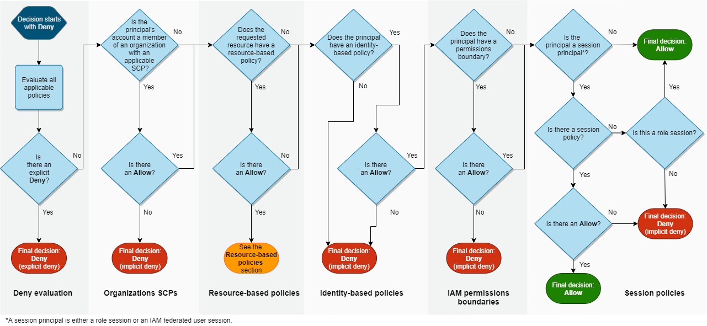

# AWS Infrastructure

## Networking

### Global services

* Cludfront
* Route 53
* IAM
* Organizations
* STS

### Regional architecture

* **Region:** a physical location in the world where a cluster of data centers is present
  * **Availability Zone:** one or more discrete data centers with redundant power, networking, and connectivity in an AWS Region. These separations mean that an outage of one AZ due to lost power, networking issues, or ISP connectivity issues should not affect any other AZ
    * S3 Bucket
    * VPC
      * Gateway
      * Amazon DNS resolver instance
      * Amazon Time Sync Service
      * Microsoft KMS Service
      * Elastic IP Address range
      * EC2 Instance Metadata Service
      * ECS Task Metadata Service
      * EC2 Instances
      * VPC Endpoints

## Access Control

### Accounts

An AWS account is a container for your AWS resources. AWS accounts are designated by a 12-digit unique number known as an Account ID (XXXX-XXXX-XX). AWS accounts are used together with IAM (access control) and AWS Identity to create a security boundary around a specific user by defining roles and allowed actions.

### AWS Root account

To sign up for an AWS account, AWS users provide a root user e-mail address. An e-mail address can only be used as the root user e-mail address for one AWS account. The root user is considered an IAM "superuser" and has complete administrative permissions against the AWS account.&#x20;

By default, root users do not have multi-factor authentication (MFA) enforced. Furthermore, root accounts that do not have MFA enabled or a phone number set are susceptible to a weak password reset workflow attack. This is commonly the case for AWS accounts created automatically using the AWS Organizations service. If an attacker gains control of the e-mail inbox for an AWS root user without MFA or a phone number on the account, the attacker will be able to send a password reset e-mail and complete a takeover of the targeted AWS account.

### IAM

The service

<figure><figcaption></figcaption></figure>

#### Authentication

The authentication procedure is composed by elements called Principals. These elements are used to define access rules to services and resources. A principal falls into one of the following categories:

* **Users**: represent a person or an application.  IAM Users are linked to a single AWS Account
* **Groups**:
* **Roles**:
* **Policies**:

<figure><figcaption></figcaption></figure>
