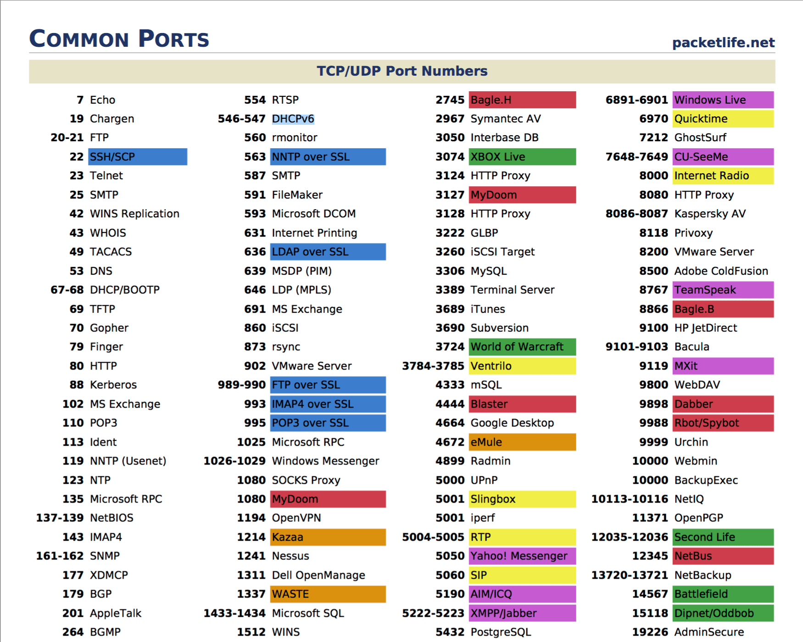

# Ports

## Windows ports

| Number  | Service        | Protocol |
| ------- | -------------- | -------- |
| 20      | FTP            | TCP      |
| 21      | FTP            | TCP      |
| 22      | SSH            | TCP UDP  |
| 23      | Telnet         | TCP      |
| 25      | SMTP           | TCP      |
| 50      | IPSec          | Own      |
| 51      | IPSec          | Own      |
| 53      | DNS            | TCP UDP  |
| 67      | DHCP           | UDP      |
| 68      | DHCP           | UDP      |
| 69      | TFTP           | UDP      |
| 80      | HTTP           | TCP      |
| 110     | POP3           | TCP      |
| 119     | NNTP           | UDP      |
| 123     | NTP            | UDP      |
| 135-139 | NetBIOS        | TCP UDP  |
| 143     | IMAP 4         | TCP UDP  |
| 161     | SNMP           | TCP UDP  |
| 162     | SNMP           | TCP UDP  |
| 389     | LDAP           | TCP UDP  |
| 443     | HTTP on SSL    | TCP UDP  |
| 989     | FTP on SSL\TLS | TCP      |
| 990     | FTP on SSL\TLS | TCP      |
| 3389    | RDP            | TCP UDP  |
| 4167    | ISS            | TCP      |

## Known ports

