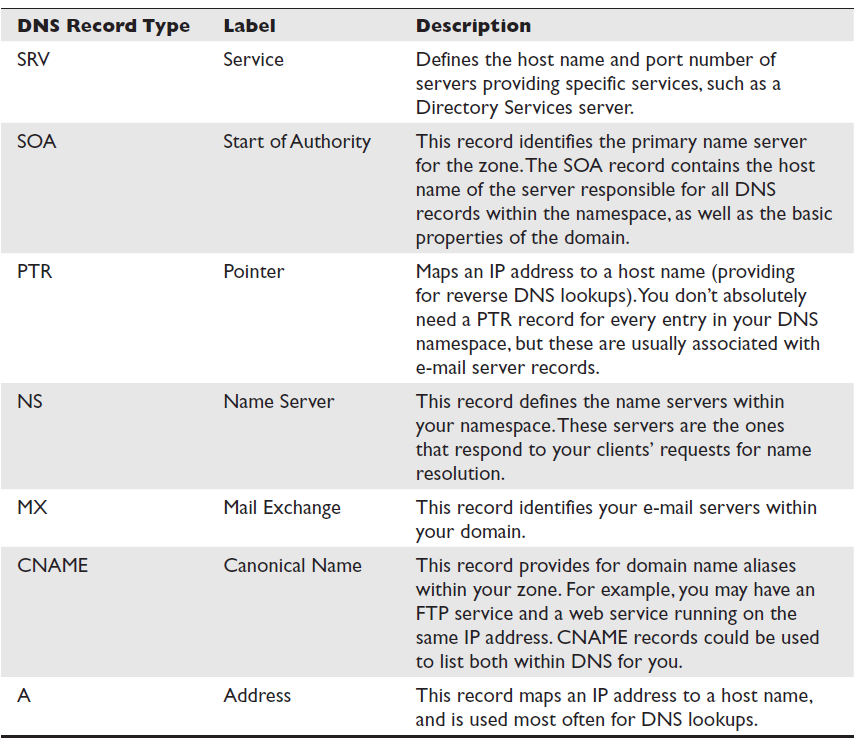

# DNS

## Records



## Enumeration tools

### Queries

#### Lookup

```
host -t <record type> <domain>
for $ip in $(cat <file>); do host $ip.<domain>; done
```

#### Reverse lookup

```
host -t <record type> <ip addr>
for ip in $(seq 0 254); do host <ip addr>.$ip done; | grep -v “not found”
```

#### Zone transfer

```
host -l <domain> <dns server ip>
```

### DNSenum

```
dnsenum -d <domain>
```

### DNSrecon

```
python dnsrecon.py -d <domain> -t std              #lookup
python dnsrecon.py -r <ip range or cidr> -t rvl    #reverse lookup
python dnsrecon.py -d <domain> -t brt -D <dict>    #bruteforce names from dictionatu
```

#### standard query types

```
-t std -a		Perform AXFR with standard enumeration.
-t std -s		Perform a reverse lookup of IPv4 ranges in the SPF record with standard enumeration.
-t std -g		Perform Google enumeration with standard enumeration.
-t std -b		Perform Bing enumeration with standard enumeration.
-t std -k		Perform crt.sh enumeration with standard enumeration.
-t std -w		Perform deep whois record analysis and reverse lookup of IP ranges found through Whois when doing a standard enumeration.
-t std -z	  Performs a DNSSEC zone walk with standard enumeration.
```

